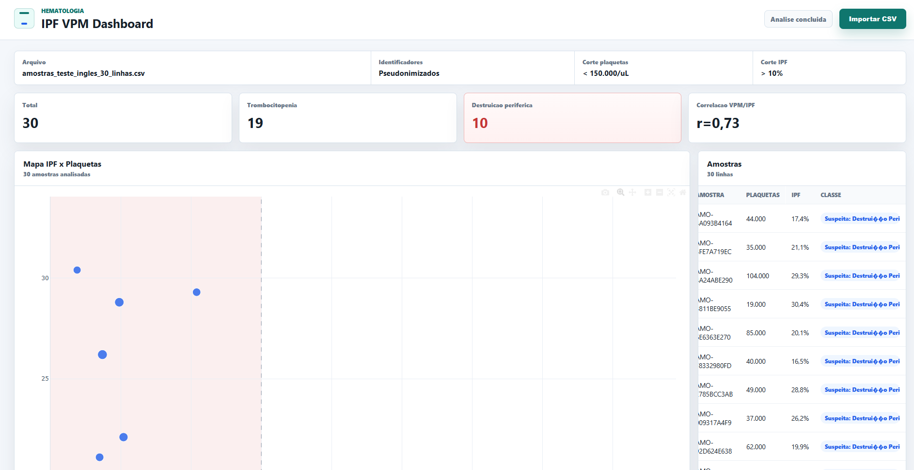
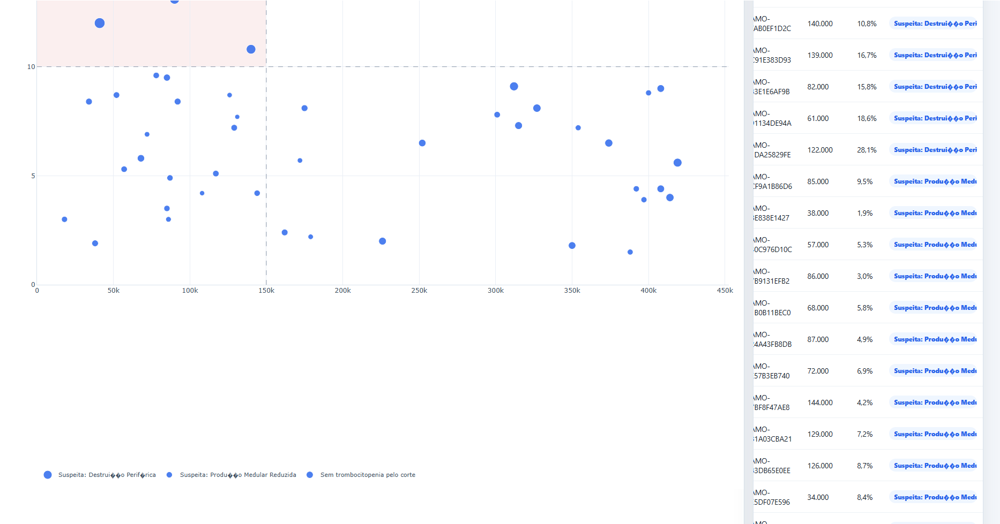

# HemoView IPF

O **HemoView IPF** é um aplicativo desktop offline desenvolvido para otimizar a interpretação laboratorial de quadros de trombocitopenia, processando exportações reais de analisadores hematológicos de forma segura, automatizada e visual.

## 🎯 O Problema Clínico e Objetivo

Na rotina de Hematologia, diferenciar uma trombocitopenia causada por **destruição periférica** (como na Púrpura Trombocitopênica Imunológica - PTI) de uma **falha na produção medular** (como na aplasia de medula ou quimioterapia) é um desafio diário. Índices avançados como a **Fração de Plaquetas Imaturas (IPF)** e o **Volume Plaquetário Médio (VPM)** fornecem um excelente suporte à decisão clínica, funcionando como um "mielograma não-invasivo". 

No entanto, extrair inteligência desses dados em massa diretamente das planilhas brutas exportadas pelos equipamentos (como a linha Sysmex XN) é inviável na dinâmica acelerada da bancada. O **HemoView IPF** resolve esse gargalo ao centralizar, classificar e vetorizar esses dados em um dashboard dinâmico.

## 💡 Funcionalidades Principais

- **Análise em Tempo Real:** Importação direta de arquivos CSV gerados por contadores hematológicos.
- **Suporte à Decisão:** Classificação automática com base em algoritmos de corte configuráveis.
- **Visualização Avançada:** Geração de gráficos de dispersão interativos para mapeamento de populações de pacientes.
- **Foco em Segurança e LGPD:** Processamento 100% local (offline) com pseudonimização automática de IDs de amostras por padrão.

---

## 📸 Demonstração da Interface

Abaixo estão as capturas de tela do sistema em funcionamento na rotina laboratorial:


*Figura 1: Interface principal de carregamento e estrutura de diretórios do ecossistema.*


*Figura 2: Dashboard interativo com Plotly.js mapeando a correlação Plaquetas vs IPF.*

---

## ⚙️ Stack Tecnológica e Arquitetura

O projeto adota uma arquitetura híbrida para garantir robustez estatística e interface fluida para o usuário final:

- **Backend Analítico (Motor):** Python, Pandas (manipulação de dataframes) e SciPy (cálculos estatísticos).
- **Frontend Visual:** HTML5, CSS3, JavaScript puro (ES6) e Plotly.js para renderização de gráficos interativos.
- **Ambiente Desktop:** Node.js, Electron (encapsulamento offline) e electron-builder.

## 📊 Colunas Esperadas no CSV

O aplicativo realiza a varredura e busca aliases configurados no arquivo dinâmico `config/columns.json` para mapear os seguintes parâmetros:

- `id`: identificador único da amostra.
- `platelets`: contagem global de plaquetas.
- `vpm`: volume plaquetário médio.
- `ipf`: fração de plaquetas imaturas.

> **Nota de Compatibilidade:** Se o equipamento do seu laboratório exportar cabeçalhos com nomenclaturas diferentes, basta ajustar os nomes correspondentes dentro de `config/columns.json`. O script realiza a detecção automática do separador do CSV e possui fallback de *encoding* (tenta ler em UTF-8, com fallback automático para Latin-1).

## 📐 Regras de Classificação Clínica

Os parâmetros de corte atuais estão centralizados em `config/rules.json`:

- Plaquetas `< 150000/uL` e IPF `> 10%`: 🔴 `Suspeita: Destruição Periférica`.
- Plaquetas `< 150000/uL` e IPF `<= 10%`: 🟡 `Suspeita: Produção Medular Reduzida`.
- Demais amostras: 🟢 `Sem trombocitopenia pelo corte`.

*Nota: Estes valores são totalmente customizáveis no arquivo de configuração e devem ser validados pelo responsável técnico do laboratório antes do uso operacional.*

## 🔒 Segurança de Dados e LGPD

- **Privacidade por Design:** O Electron faz a ponte dos dados diretamente para o processo Python via saída padrão (*stdout*). Nenhum dado do paciente é transmitido para servidores externos ou nuvem.
- **Proteção de Identidade:** Por padrão, o `ID_Amostra` original é mascarado em um código pseudonimizado (`AMO-...`) antes de ser renderizado na tela.
- **Ambiente Seguro:** Para visualização dos IDs originais em ambiente de auditoria autorizado, execute a aplicação com a flag `KEEP_SAMPLE_IDS=1`.

---

## 💻 Instalação e Execução Local (Desenvolvimento)

Caso queira clonar o repositório e rodar o ambiente de desenvolvimento, certifique-se de ter o Python 3 e o Node.js instalados.

1. Configure o ambiente virtual do Python:
```powershell
python -m venv .venv
.\.venv\Scripts\Activate.ps1
pip install -r requirements.txt
pip install -r requirements-build.txt```

2. Configure o ambiente de build secundário (necessário para o empacotador):
```python -m venv .venv-build
.\.venv-build\Scripts\python.exe -m pip install -r requirements.txt -r requirements-build.txt```

3. Instale os módulos do Node.js e inicialize o Electron:

```npm install
$env:PYTHON_PATH = "$PWD\.venv\Scripts\python.exe"
npm start```

Execution via Terminal (Apenas Backend)
Para processar os dados diretamente pela linha de comando sem abrir a interface gráfica:

```python src/backend/analise_ipf.py C:\caminho\para\exportacao.csv --columns-config config/columns.json --rules-config config/rules.json```

## 📦 Distribuição e Compilação (Gerar .exe)
Para gerar o instalador do Windows totalmente independente (que inclui o backend embutido via PyInstaller, dispensando a instalação do Python nas máquinas de bancada), execute:

```npm run build```

O executável final pronto para instalação será gerado no diretório dist/.

## 👨‍🔬 Autor
Matheus Medeiros Da Silva
Biomedical Scientist (CRBM-2) | Clinical Analyst | Hospital and Laboratory Management | Hematology and Microscopy

A integração de ferramentas tecnológicas, como Node e Electron, atua como um grande diferencial na minha prática profissional, permitindo o desenvolvimento 
de soluções robustas para a otimização de rotinas laboratoriais e o aprimoramento da análise de dados em saúde.

Localização: Fortaleza, CE
LinkedIn: www.linkedin.com/in/matheus-medeiros-silva
Contato: contato.matheusms.pro@gmail.com

